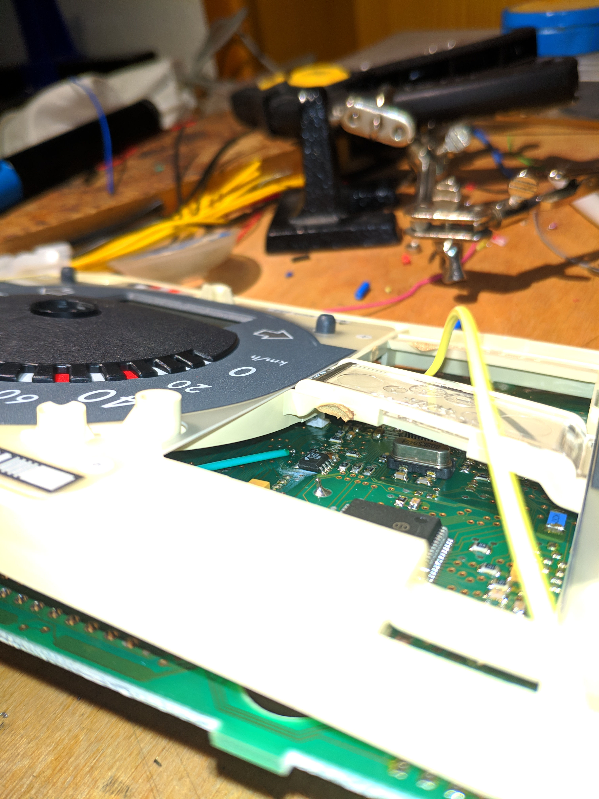
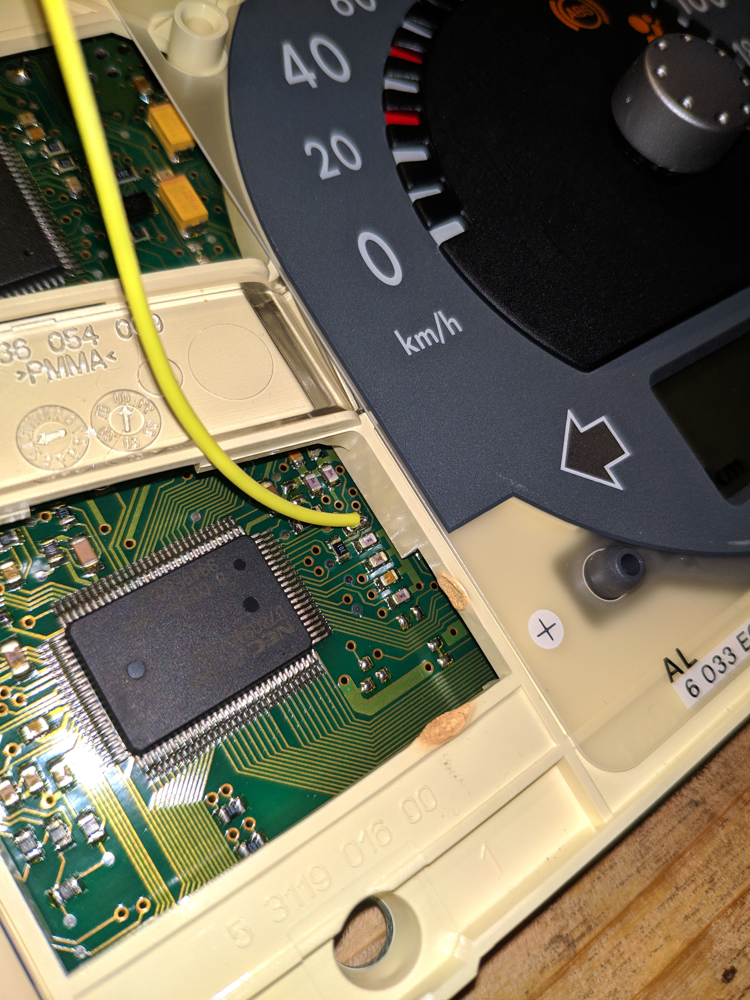
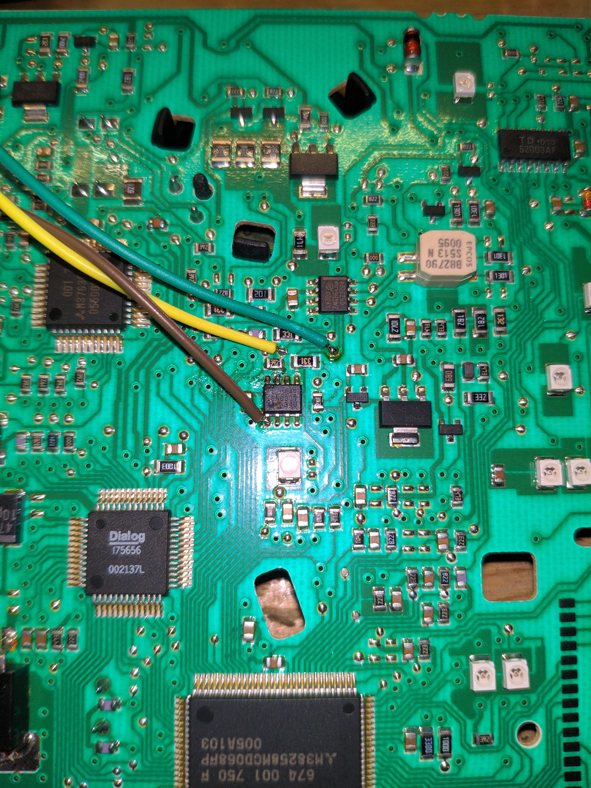

# Polo 6N2 Tacho

Der Kilometerzähler kann beim Tacho vom Polo 6N2 (eventuell auch beim Lupo
verwendet) angepasst werden. Folgendes bezieht sich dabei auf das Tacho mit der
Teilnummer 6N0920804D, wobei es mindestens zwei Versionen des Tachos mit der
dieser Teilnummer gibt, die eingebaut zwar gleich aussehen, aber ansonsten
komplett unterschiedliche Tachos sind. Ich weiß nicht, ob es noch andere
Versionen gibt. Im Folgenden werde ich die mir bekannten zwei Version
beschreiben, welche ich mit "Version 1" und "Version 2" bezeichne.


## Interner Aufbau

Auf beiden Tachos sind mehrere ICs zu finden, wobei einer für die Ansteuerung
der LC-Displays zuständig ist, einer für die Ansteuerung der Schrittmotoren,
ein Hauptprozessor und ein I2C EEPROM. Im EEPROM ist der Kilometerstand
gespeichert. Man muss also nur Masse (Klemme 31), Batterieplus (Klemme 30) und
Zündungsplus (Klemme 15) über den blauen Stecker anschließen und jeweils ein
Kabel an SDA/SCL des EEPROMs anlöten. Dann kann man damit das EEPROM auslesen
und beschreiben. Der WP-Pin (write protect, siehe Datenblatt) ist bei beiden
Version mit Masse verbunden, wodurch der Schreibschutz dauerhaft inaktiv ist.


## EEPROM

Auf das EEPROM wird beim "Boot" des Tacho zugegriffen, also wenn Klemme 30 und
31 angeschlossen werden. Danach habe ich weitere Zugriffe nur beim Aktualisieren
des Kilometerzählers gesehen (mit simuliertem Tachosignal). Ich habe allerdings
nicht geprüft, ob auch beim Einschalten der Zündung (Klemme 15) auf das EEPROM
zugegriffen wird. Sofern man nach dem Einschalten mindestens eine Sekunde
wartet, wird aber definitiv nicht mehr auf das EEPROM zugegriffen, sodass man
selbst auf das EEPROM zugreifen kann.


## Pinbelegung

Das Tacho hat einen grünen und einen blauen Stecker, wobei das meiste über den
blauen Stecker angeschlossen ist. Im Stecker sind die Pins mit Zahlen markiert.

Blauer Stecker:
- Pin 1: Zündungsplus (Klemme 15)
- Pin 23: Batterieplus (Klemme 30)
- Pin 24: Masse (Klemme 31)
- Pin 28: Eingang des Tachosignals

Es gibt mehrere Pins für die Masse, wobei alle intern verbunden sind. Daher
genügt es, die Masse an einem Pin anzuschließen.


## Tacho auseinanderbauen

Das Tachogehäuse ist entweder mit 6 Torx-10 Schrauben (Version 1) oder 4 PH
Schrauben (Version 2) verschraubt. Nach dem Entfernen, kann die Rückseite
abgenommen werden. Bei Version 1 kann die Platine dann direkt entnommen werden.
Bei Version 2 ist die Platine in die Gehäuserückseite geclipst und kann dann aus
der Rückseite mit drei Clips am Rand der Platine herausgelöst werden.

Die Tachonadeln sind aufgesteckt. Diese können einfach abgezogen werden. Beim
ersten Mal kann dies jedoch sehr schwer sein, hier helfen zwei Löffel, mit denen
man gleichzeitig von beiden Seiten die Nadel nach oben raushebelt. Danch kann
bei Version 2 die jeweilige Seite von der Platine abgeclipst werden, wobei ich
nur die rechte Seite demontiert hatte. Bei Version 1 sind beide Seiten
miteinander mit einem großen Kunststoffteil verbunden. Hier muss auch die rechte
Nadel entfernt werden, dann kann die rechte Seite ausgeclipst und leicht nach
oben gebogen werden. Damit erreicht man alle nötigen Kontakte für das EEPROM.


## Tacho zusammenbauen

Prinzipiell erfolgt der Zusammenbau in umgekehrter Reihenfolge. Bei den Nadeln
ist jedoch auf die korrekte Position zu achten. Dazu setzt man die Nadel
zunächst leicht auf, sodass man den Motor drehen kann. Im Motor sind zwei
Endanschläge. Der Motor muss dann auf die entsprechende Nullposition gedreht
werden. Dann kann man die Nadel in der korrekten Position aufsetzen. Hierbei
hilft es auch, nach dem Aufsetzen der Nadel kurz die Stromversorgung zu
aktivieren. Damit dreht das Tacho alle Motoren auf die Nullposition und dann ein
kleines Stück von der Nullposition weg. Falls die Nadel dann nicht auf der
Nullposition steht, muss diese abgenommen und entsprechend anders aufgesteckt
werden. Wenn die Position stimmt, die Nadel mit leichter Kraft ganz
draufdrücken.


## Lötstellen

Bei beiden Versionen haben die Platinen an vielen Stellen freie Punkte in den
Leiterbahnen, an denen Kabel angelötet werden können. Bei Version 2 könnte man
auch die Kabel direkt an die Beine des EEPROMs anlöten, jedoch ist dies
schwieriger. Bei Version 1 kommt man ohne Vollständige Demontage gar nicht an
die Beine des EEPROMs.

Im Folgenden ist das grüne Kabel SDA und das gelbe Kabel SCL. Das braune Kabel
ist Masse.


### Version 1

SDA | SCL
:-:|:-:
 | 


### Version 2




## Schaltung

Die beiden Kabel (SDA, SCL) habe ich jeweils über einen 150 Ohm Widerstand mit
einem Arduino Uno verbunden (mit 470 Ohm Widerständen hatte ich bei Version 1
Probleme, also größer sollten die Widerstände nicht sein). SDA/grün wird dabei
an A4 und SCL/gelb an A5 angeschlossen. Der Widerstand wird eigentlich nicht
benötigt und dient nur als Schutz gegen einen eventuellen Kurzschluss. An den
Kabeln zum Tacho hatte ich zusätzlich einen Logic Analyzer angeschlossen.


## Tachosignal

Am Eingang für das Tachosignal liegt im Betrieb eine Spannung von rund 10V an.
Ich habe nicht geprüft, ob man diesen ohne Widerstand auf Masse schalten darf.
Daher habe ich mit einem BC547 Transitor und einem 220 Ohm Widerstand das
Tachosignal auf Masse geschaltet. Der Transitor wird über einen 1 kOhm
Widerstand vom Arduino gesteuert. Ein größerer Widerstand statt dem 220 Ohm
Widerstand funktioniert nicht (zumindest 470 Ohm ist zu groß, das Tachosignal
wird dann nicht erkannt).

Das Tachosignal hat eine Rechteckform und die Frequenz in Hertz entspricht grob
der Geschwindigkeit in km/h (bei 200 Hz wird 186 km/h angezeigt, also errechnet
sich die exakte Geschwindigkeit aus `freq * 200/186`.


## Datenformat

Das EEPROM von Version 1 ist 2 kBit bzw. 256 Byte, das von Version 2 4 kBit
bzw. 512 Byte groß. Der Kilometerstand wird jeweils an anderer Stelle und in
einem anderen Format gespeichert. Das ganze EEPROM zu löschen (also mit `0xFF`
zu beschreiben), führt bei beiden Version dazu, dass das Tacho nicht mehr
funktioniert. Der Kilometerstand muss also auch zum Zurücksetzen auf 0 gezielt
angepasst werden.


### Version 1

Der Kilometerstand ist in den Bytes 16-31 gespeichert. Im Folgenden wird dieser
Block aus 16 Bytes in einer 4x4 Matrix dargestellt, wobei die jeweiligen
Einträge der folgenden Bytes im EEPROM entsprechen:

```
10 11 12 13
14 15 16 17
18 19 1a 1b
1c 1d 1e 1f
```

Der Kilometerstand errechnet sich aus der Addition von 14, aller geraden Bytes
multipliziert mit 2 sowie aller ungeraden Bytes multipliziert mit 512. Dabei
gibt es theoretisch mehrere Möglichkeiten den Kilometerstand zu kodieren. Im
Folgenden erkläre ich, wie der Kilometerstand nach meinen Versuchen vom Tacho
kodiert wurde und dann auch korrekt vom Tacho erkannt wird. Es gibt ungültige
Werte, bei denen das Tacho nicht funktioniert.

Vom Kilometerstand muss immer zunächst 14 abgezogen und das Ergebnis durch 2
geteilt werden (d. h. es können nur gerade Kilometerstände gespeichert werden).
Diese Zahl wird im Folgenden als `x` bezeichnet.

In den "geraden" Bytes (`10`, `12`, `14`, ...) werden die unteren 11 Bit von `x`
gespeichert. Dazu werden alle geraden Bytes auf `x/8` gesetzt. Damit fehlen dann
noch die unteren 3 Bits. Hierfür werden die ersten `x%8` geraden Bytes um `1`
erhöht. Wenn `x/8` `0xFF` ist, dann läuft die Addition über und das Byte wird
auf `0x00` gesetzt.

**Beispiel:**

```
Kilometerstand = 20 km
x = (20-14)/2 = 3

01 00 01 00
01 00 00 00
00 00 00 00
00 00 00 00

Kilometerstand = 22 km
x = (22-14)/2 = 4

01 00 01 00
01 00 01 00
00 00 00 00
00 00 00 00

Kilometerstand = 32 km
x = (32-14)/2 = 9

02 00 01 00
01 00 01 00
01 00 01 00
01 00 01 00
```

Nun zieht man von `x` die Summe aller geraden Bytes ab. Die neue Zahl heißt `y`.
`y` ist immer durch `2^8` teilbar. `y / 2^8` wird genauso wie die unteren 11
Bits in den ungeraden Bytes kodiert.

**Beispiel:**

```
Kilometerstand = 4094 km
x = (4094-14)/2 = 2040 (= 8*255)
y = 0

ff 00 ff 00
ff 00 ff 00
ff 00 ff 00
ff 00 ff 00

Kilometerstand = 4096 km
x = (4096-14)/2 = 2041
y = 256 = 1 * 2^8

00 01 ff 00
ff 00 ff 00
ff 00 ff 00
ff 00 ff 00

Kilometerstand = 4100 km
x = (4100-14)/2 = 2043
y = 768 = 3 * 2^8

00 01 00 01
00 01 ff 00
ff 00 ff 00
ff 00 ff 00

Kilometerstand = 4108 km
x = (4108-14)/2 = 2047
y = 1792 = 7 * 2^8

00 01 00 01
00 01 00 01
00 01 00 01
00 01 ff 00

Kilometerstand = 4110 km
x = (4110-14)/2 = 2048
y = 2048 = 8 * 2^8

00 01 00 01
00 01 00 01
00 01 00 01
00 01 00 01

Kilometerstand = 4112 km
x = (4112-14)/2 = 2049
y = 2048 = 8 * 2^8

01 01 00 01
00 01 00 01
00 01 00 01
00 01 00 01

Kilometerstand = 4132 km
x = (4132-14)/2 = 2059
y = 2048 = 8 * 2^8

02 01 02 01
02 01 01 01
01 01 01 01
01 01 01 01

Kilometerstand = 123456 km
x = (123456-14)/2 = 61721
y = 61440 = 240 * 2^8

24 1e 23 1e
23 1e 23 1e
23 1e 23 1e
23 1e 23 1e
```


### Version 2

Bei Version 2 ist der Kilometerstand an mehreren Stellen im EEPROM gespeichert.
Der kodierte Kilometerstand umfasst 4 Bytes, 3 Datenbytes und eine Prüfsumme.
Dieser Block aus 4 Bytes wird wiederholt im Adressbereich 0-47 sowie 256-303
gespeichert. Der zweite Adressbereich scheint ein Backup/Fallback für den ersten
Block zu sein. Daher sind zum Ändern der Kilometerzählers die Bytes im zweiten
Block zu löschen (z. B. alle auf 0xFF setzen). Damit sind die Einträge ungültig
und werden ignoriert. Es wird anscheinend der Kilometerstand verwendet, der am
höchsten ist und eine gültige Prüfsumme hat. Daher sind auch die Einträge im
ersten Adressbereich zu löschen und z. B. die Bytes 0-3 mit einem neuen
Kilometerstand zu beschreiben.

Die ersten drei Bytes sind der Kilometerstand im Little Endian Format, also das
niederwertigste Byte zuerst. Das vierte Byte ist die Prüfsumme, welche sich aus
den ersten drei Bytes mit folgendem Algorithmus berechnet:

```
sum := 0x5A
for i in (0, 1, 2):
    sum := sum - ((data[i]>>0) & 0x0F)
    sum := sum + ((data[i]>>4) & 0x0F) * 0x0F
```

**Beispiel:**

```
Kilometerstand = 0 km
00 00 00 5a

Kilometerstand = 1 km
01 00 00 59

Kilometerstand = 16 km
10 00 00 69

Kilometerstand = 123456 km
40 e2 01 65
```

